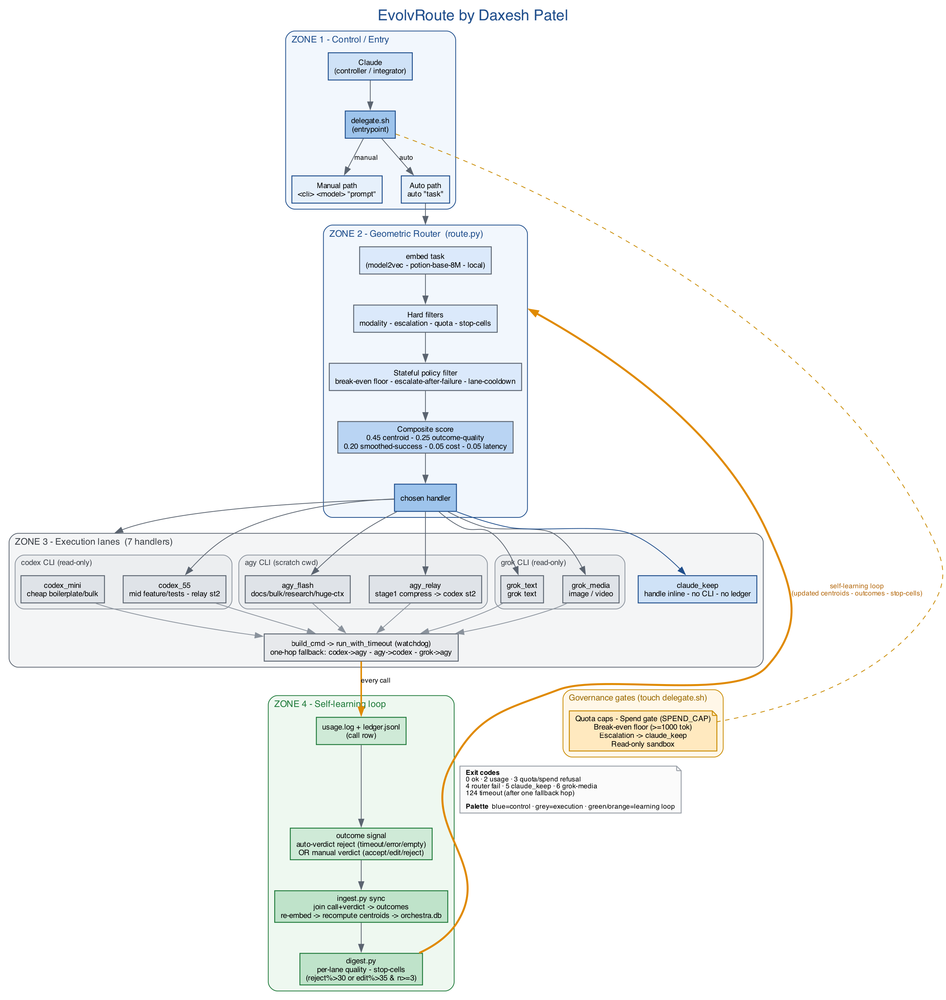
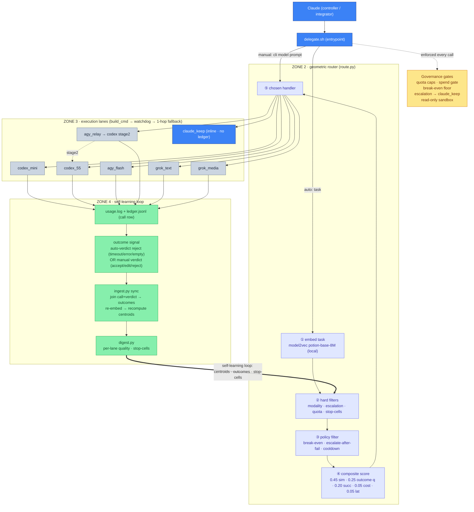

# EvolvRoute — Architecture
**by Daxesh Patel**



> A self-learning, multi-CLI **delegation harness**. Claude is the controller and
> integrator; three external worker CLIs — `codex` (OpenAI), `agy` (Antigravity /
> Gemini), and `grok` (xAI) — do the bulk, parallel, and media work on their **own
> subscription quotas** so Claude's metered budget is reserved for high-value
> judgment. A geometric router on top learns from real outcomes which lane to send
> each task to. No daemon, no queue, no framework — one shell entrypoint
> (`delegate.sh`), a small Python router, and a ledger-driven learning loop.

---

## 1. Overview

EvolvRoute lets Claude offload suitable subtasks to subprocess CLIs instead of
spending its own tokens on every piece of work. Claude classifies a task, dispatches
it (manually to a named lane, or via the `auto` router), reviews the worker's **final
artifact only** (never its reasoning), integrates it as the sole writer, and records a
**verdict**. Verdicts feed a learning loop — `ingest.py` recomputes embedding centroids
in a SQLite store, `digest.py` rolls up per-lane quality and writes "stop-cells" — so the
**geometric router** improves its lane choices over time. The whole thing is intentionally
thin: a documented contract plus a feedback loop.

## 2. Design goals

| Goal | How it's met |
|---|---|
| **Token efficiency** | Worker CLIs spend their own subscription quota, not Anthropic API credits. Low/mid-tier work with a clear spec + cheap verification routes out for free. |
| **Claude keeps high-value work** | Architecture, review, planning, and complex debugging are hard-escalated to `claude_keep` and never delegated. |
| **Learn-from-history routing** | A geometric router scores lanes by semantic similarity + proven outcomes, not static rules; verdicts continuously retune it. |
| **Fail-safe governance** | Quota caps, an optional spend gate, a break-even floor, escalation rules, read-only sandboxes, and a one-hop fallback chain bound every dispatch. |

## 3. Components

| File | Role |
|---|---|
| `delegate.sh` | Entrypoint — manual dispatch, `auto` routing, quota report, verdict recording. Enforces governance gates and the fallback hop. |
| `router/route.py` | Geometric router — embeds the task, applies hard + policy filters, composite-scores lanes, logs every decision. |
| `router/ingest.py` | `sync` — joins call rows + verdicts into outcomes, re-embeds, recomputes centroids into `orchestra.db`. |
| `digest.py` | Rolls up the ledger into `DIGEST.md` (per-lane accept/edit/reject, coverage, latency) and writes stop-cells. |
| `router/policies.json` | Tunable thresholds — break-even floor, score weights, cooldown, stop-cell triggers. |
| `router/handlers.json` | Handler capability cards — the **declared routing prior** (tags, modality, cost/latency class). |
| `MODEL_REGISTRY.md` | Per-CLI capabilities, models, quotas, exact headless syntax, measured timeouts, notional rates. |
| `router/orchestra.db` | SQLite store (gitignored, rebuilt by `sync`) — handlers, outcomes, centroids, invocations. |
| `ledger.jsonl` | Rich call + verdict rows — the learning signal. |
| `usage.log` | One JSON line per final call — feeds the `quota` report. |
| `DIGEST.md` | Latest ledger rollup, human-readable. |
| `router/stopcells.json` | Bad `lane × task_type` cells, hard-filtered by the router. |

## 4. Worker CLIs & the 7 handler lanes

Three external CLIs own six lanes; Claude is the seventh (the floor, never excluded).

| Handler | Owner CLI | Purpose | Cost / latency |
|---|---|---|---|
| `codex_mini` | codex (OpenAI) | Cheap boilerplate / bulk generation | sub · low |
| `codex_55` | codex (OpenAI) | Mid feature / tests; relay **stage 2** | sub · medium |
| `agy_flash` | agy (Gemini) | Docs, bulk text, research, huge-context reads | sub · medium (~70s cold start) |
| `agy_relay` | agy (Gemini) | Relay **stage 1** — compress huge context → hand to `codex_55` | sub · medium |
| `grok_text` | grok (xAI) | Grok text generation | sub · medium |
| `grok_media` | grok (xAI) | Image / video (media-only, `--always-approve`) | sub · high |
| `claude_keep` | Claude (inline) | Handle directly — **no CLI call, no ledger row**; the floor lane | claude · n/a |

Workers run **read-only** (`codex`/`grok` use `--sandbox read-only`; `agy` runs from a
throwaway scratch cwd and therefore needs **absolute paths** to read the repo). Claude is
the single writer of record.

## 5. Request flow

**Manual path** — Claude already knows the lane:

1. `./delegate.sh [--code] <cli> <model|-> "<prompt>" [timeout]`
2. Governance gates run (quota / spend / sandbox). Router is skipped.
3. `build_cmd` → `run_with_timeout` (watchdog) → one-hop fallback on timeout/empty.
4. stdout = the artifact; `id=<id>` printed to stderr for the verdict.

**Auto path** — let the router choose:

1. `./delegate.sh auto "<task>"` (with optional `TASK_TYPE` / `SIZE_CLASS` / `MODALITY`).
2. `route.py` embeds the task → hard filters → policy filter → composite score → chosen handler.
3. Exit code signals what to do: dispatch, handle inline, or use the media commands.
4. On dispatch, same execute → fallback → ledger path as manual.

**Exit codes**

| Exit | Meaning |
|---|---|
| 0 | OK — stdout is the artifact |
| 2 | usage error |
| 3 | `STRICT_QUOTA` / `STRICT_SPEND` refusal, no call made |
| 4 | router / parse failure (`auto` only) |
| 5 | `claude_keep` — handle inline, no CLI call, no ledger row |
| 6 | `grok_media` — use the imagine commands in `MODEL_REGISTRY.md` |
| 124 | timeout (after one fallback-lane hop: codex→agy, agy→codex, grok→agy) |

## 6. The geometric router

**Embedding.** Tasks are embedded with **`model2vec:potion-base-8M`** — a small static
model that runs **locally and offline** and produces real semantic similarity. It
**replaced** an earlier hashed bag-of-words fallback, which was too coarse to make
cosine similarity meaningful.

**Hard filters** (a lane is dropped outright): modality (media ↔ `grok_media`),
escalation (`risk=high` or task_type architecture/review/planning → `claude_keep` only),
per-owner quota windows, and stop-cells from `stopcells.json`. `claude_keep` is the floor
and is never filtered out.

**Stateful policy filter** (3 rules):

- **Break-even floor** — tasks below `min_delegate_tokens` (1000; media exempt) stay inline.
- **Escalate-after-failure** — a lane that just failed this task type is held back.
- **Lane-cooldown** — a recently-failing lane is briefly benched.

**Composite score:**

```
score = 0.45 · cosine(query, centroid)
      + 0.25 · max_i( cosine(query, outcome_i) · quality_i )
      + 0.20 · smoothed_success
      + 0.05 · cost_pref
      + 0.05 · latency_pref
```

- `smoothed_success = (Σ wᵢ·successᵢ + 2·0.7) / (Σ wᵢ + 2)` — a Bayesian estimate with
  **prior 0.7** and **pseudo-count 2**; `successᵢ = 1` if `qualityᵢ ≥ 0.7`; weight
  `wᵢ = 1.0` if the outcome is ≤30 days old, else `0.5` (recency half-weight).
- `cost_pref`: free = 1.0 · sub = 0.6 · claude = 0.1.
- `latency_pref`: low = 1.0 · med = 0.7 · high = 0.4.

The centroid term dominates early; the outcome and smoothed-success terms grow in
influence as verdicts accumulate.

## 7. The self-learning loop

This is the centerpiece — the arc that runs **executed lane → ledger → outcome → ingest →
digest → back into the router.**

1. **Call.** Every dispatched lane writes a call row to `usage.log` + `ledger.jsonl`.
2. **Outcome signal.** Two ways a row gets a quality signal:
   - **Auto-verdict reject** — an objective failure (timeout, error, or empty output)
     is recorded as a negative outcome with **zero human input**. This closes the old
     "no negative signal" gap: failures used to leave no trace, so a bad lane never lost
     score. Now it does, automatically.
   - **Manual verdict** — `./delegate.sh verdict <id> accept|edit|reject [edit_pct]`
     (`verdict_source: manual`) captures human quality judgment.
3. **Ingest.** `ingest.py sync` joins call + verdict rows into **outcomes**, re-embeds
   them, and **recomputes centroids** in `orchestra.db`. Each handler's centroid is the
   **declared vector ⊕ (successes − failures)**, confidence-weighted so the declared
   vector dominates until ~20 outcomes have accrued — the router behaves sanely on day
   one and shifts toward evidence as data arrives.
4. **Digest.** `digest.py` rolls up per-lane quality and writes **stop-cells** — a
   `lane × task_type` cell is hard-banned when `reject% > 30` or `edit% > 35` with `n ≥ 3`.
5. **Improve.** Next `auto` call, the router reads the updated **centroids + outcomes +
   stop-cells** and scores accordingly.

**Why each piece matters:**

- **Auto-verdict** fixes the missing-negative-signal gap — the loop learns from failures
  without anyone remembering to file a verdict.
- **model2vec** makes the similarity terms meaningful (a hashed BoW could not).
- **Break-even floor** keeps tiny, not-worth-delegating tasks out of the loop, so the
  outcome corpus stays signal-rich.
- **Auto-sync** runs `ingest` + `digest` after each verdict (unless `NO_AUTOSYNC=1`), so
  the loop closes with **no manual step** — centroids and stop-cells stay fresh.



## 8. Control & governance

| Gate | Behavior |
|---|---|
| **Quota caps** | `CODEX_CAP` 40/5h · `AGY_CAP` 800/24h · `GROK_CAP` 150/24h. `STRICT_QUOTA=1` refuses over-cap (exit 3); default warns. |
| **Spend gate** | Notional USD ceiling `SPEND_CAP` (unset = off) against `model_rate` rates in `MODEL_REGISTRY.md`. `STRICT_SPEND=1` refuses over-spend (exit 3). `MEDIA_FLAT_USD` (0.04) per grok-media call. |
| **Break-even floor** | `min_delegate_tokens` 1000 — smaller tasks handled inline; media exempt. |
| **Escalation** | High-risk / architecture / review / planning → `claude_keep` only. |
| **Sandbox** | `codex`/`grok` read-only; `agy` runs from a scratch cwd (absolute paths required to read the repo). |
| **Fallback chain** | One hop on timeout/empty: codex→agy, agy→codex, grok→agy. |

## 9. Reference

**Environment variables**

| Name | Default | Effect |
|---|---|---|
| `TASK_TYPE` | unknown | code/test/doc/research/media/refactor/other classifier |
| `SIZE_CLASS` | unknown | small/medium/large |
| `MODALITY` | text | text/image/video (routes media → `grok_media`) |
| `TO` | 150 | default per-call timeout (secs); per-call arg wins |
| `FALLBACK_TO` | 150 | fallback-hop timeout floor |
| `AGY_MIN_TO` | 180 | floors direct agy calls (cold start) |
| `STRICT_QUOTA` | 0 | refuse over-cap dispatch (exit 3) instead of warn |
| `CODEX_CAP` / `AGY_CAP` / `GROK_CAP` | 40 / 800 / 150 | per-owner soft caps |
| `SPEND_CAP` | unset | notional USD ceiling on today's spend |
| `STRICT_SPEND` | 0 | refuse over-spend dispatch (exit 3) instead of warn |
| `MEDIA_FLAT_USD` | 0.04 | flat notional cost per grok-media call |
| `MIN_DELEGATE_TOKENS` | policies (1000) | break-even floor |
| `NO_AUTOSYNC` | 0 | skip post-verdict `ingest` + `digest` |
| `LEDGER` | `SCRIPT_DIR/ledger.jsonl` | ledger path override |
| `USAGE_LOG` | `SCRIPT_DIR/usage.log` | usage-log path override |

**Subcommands**

| Subcommand | Purpose |
|---|---|
| `auto "<task>"` | Routed dispatch via `route.py` |
| `<cli> <model\|-> "<prompt>" [to]` | Manual dispatch (`-` = CLI default; codex accepts `mini`) |
| `grok-media "<prompt>" [to]` | Media generation path |
| `quota` | Today's per-CLI burn (no CLI call) |
| `verdict <id> accept\|edit\|reject [edit_pct]` | Record an outcome (`verdict_source: manual`) |
| `verdicts-pending` | List unverdicted call ids |

## 10. Operating the loop

```bash
# Routed dispatch (router picks the lane)
TASK_TYPE=doc SIZE_CLASS=small ./delegate.sh auto "<prompt>" [timeout]

# Manual dispatch (you name the lane)
./delegate.sh [--code] codex mini "<prompt>" [timeout]

# After integrating, record the outcome (keep the id printed to stderr)
./delegate.sh verdict <id> accept|edit|reject [edit_pct]

# What still needs a verdict
./delegate.sh verdicts-pending
```

Recording a verdict now **auto-syncs** — `ingest.py` recomputes centroids and `digest.py`
refreshes stop-cells without a manual step (set `NO_AUTOSYNC=1` to defer).

**Current state:** `model2vec` is live. The ledger holds 20 call rows / 5 verdict rows —
**verdict coverage ~25%** with **15 pending**, and `stopcells.json` is currently empty.
Driving coverage **above 70%** is the single biggest lever for the router to actually
learn — unverdicted calls teach it nothing.

## 11. Roadmap / known limits

- **Small outcome corpus** — with few outcomes per handler, routing is still
  declared-prior-dominated; the learned terms only take over around ~20 outcomes per lane.
- **Low verdict coverage** — ~25% today; the loop is only as good as the verdicts fed in.
- **Single-user, single-host by design** — no collaboration layer, no web UI, no
  OS-level sandbox (workers run under their own CLI's read-only mode plus the scratch-cwd
  convention).

---

See [FUSION_COMPARISON.md](FUSION_COMPARISON.md) for how EvolvRoute compares to OpenRouter Fusion.
