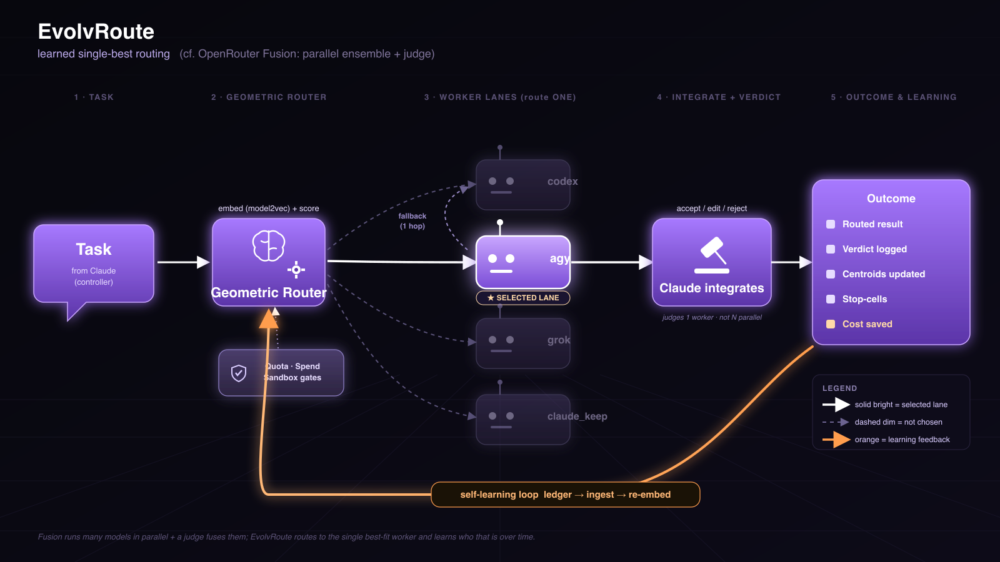

# EvolvRoute vs OpenRouter Fusion
**by Daxesh Patel**



> Two systems that look superficially alike — a prompt fans toward several models,
> something purple-and-glossy happens in the middle, a judge sits near the end — but
> they solve **opposite** problems. This note pins down the difference and sketches how
> EvolvRoute could borrow Fusion's trick when it actually pays off.

---

## 1. TL;DR

**OpenRouter Fusion and EvolvRoute optimize for opposite things.** Fusion maximizes
answer **quality and coverage**: it runs **many** models *in parallel* on one prompt
(with search + bash tools wired in), then a **judge model fuses** their outputs into a
structured meta-answer — consensus, contradictions, partial coverage, unique insights,
blind spots. That breadth costs **N× per query** and is **stateless** — every prompt pays
the full ensemble again. EvolvRoute does the inverse: it **routes one task to the
single best-fit worker** and **learns** which worker that is from real outcomes, so cost
stays **~1×** and routing **improves with history**. Fusion buys reliability with
redundancy; EvolvRoute buys efficiency with specialization plus memory.

---

## 2. The two topologies

**OpenRouter Fusion — parallel ensemble → judge → structured fusion.**

```
User Prompt ──► Fusion ──► [ model A | model B | model C | model D ]  (ALL run, in parallel)
                  ▲              │   │   │   │
       Search & Bash tools ─────┘   └───┴───┴──► Judge model ──► Structure:
                                                               consensus
                                                               contradictions
                                                               partial coverage
                                                               unique insights
                                                               blind spots
```

Every candidate model runs. Tools feed *into* the models. A dedicated judge reads **all N
candidates** and synthesizes a single meta-answer whose value is precisely the
cross-model agreement and disagreement. Nothing persists between prompts — the next query
re-runs the whole fan-out.

**EvolvRoute — router selects one → execute (1-hop fallback) → Claude verdict → learn.**

```
Task ──► Geometric Router ──► picks ONE lane ──► worker runs ──► Claude integrates ──► Outcome
   (from Claude)   ▲          (codex/agy/grok/         (read-only)   + records verdict   • routed result
                   │           claude_keep)                          (accept/edit/reject) • verdict logged
        Quota·Spend·Sandbox        │  ▲                                                   • centroids updated
        gates feed the router      │  └─ fallback (1 hop) on timeout/empty                • stop-cells
                   ▲               ▼                                                       • cost saved
                   └───────────── self-learning loop (ledger → ingest → re-embed) ◄───────┘
```

Exactly **one** lane is chosen (the diagram highlights it; the other three are dimmed).
Gates (quota / spend / sandbox) constrain the router rather than feeding the workers.
Claude judges **one** artifact, not a field of candidates, then records a verdict that
flows back through the ledger to re-tune the router — the orange loop Fusion has no
analogue for.

---

## 3. Side-by-side

| Dimension | OpenRouter Fusion | EvolvRoute |
|---|---|---|
| **Core goal** | Maximize quality / coverage of one answer | Minimize cost of getting work done |
| **Topology** | Parallel **fan-out to all** models | **Route to one** lane (7 handlers, claude_keep = floor) |
| **Cost per task** | **N×** (every model runs) | **~1×** (one worker; claude_keep = inline) |
| **Latency** | max-of-N (parallel, bounded by slowest) | single worker's latency (+ rare 1-hop fallback) |
| **Output** | Fused meta-answer: consensus · contradictions · partial coverage · unique insights · blind spots | Single worker artifact + Claude's verdict (accept/edit/reject) |
| **Learning** | Stateless — judge re-runs fresh each query | Verdict → centroid **self-learning**; routing improves over time |
| **Tool use** | Search + bash wired **into** the models | Read-only sandbox workers; gates wired **into** the router |
| **Judge role** | Judge **across N** candidates, synthesizes | Claude integrates **1** artifact, records the verdict |
| **Best for** | High-stakes / ambiguous / research one-shots | High-volume / bulk / build delegation |
| **Governance** | Model selection (which models in the ensemble) | Quota · spend · break-even · escalation gates |

---

## 4. Why the difference is fundamental

It is not a tuning knob — the two systems sit at opposite ends of the
**redundancy ↔ specialization** axis.

- **Fusion buys reliability with redundancy.** When you don't know which model is right,
  run them all and let disagreement surface the risk. The blind-spots / contradictions
  output *is* the product — you pay N× precisely to be sure. It is inherently
  **per-query**: each prompt is treated as novel, so nothing it learns on prompt *k*
  makes prompt *k+1* cheaper.
- **EvolvRoute buys efficiency with specialization + memory.** It assumes most tasks
  have a clearly-best lane and that *which* lane is best is **learnable** from history.
  The geometric router embeds the task, scores lanes against learned centroids + proven
  outcomes, picks one, and the verdict feeds back so next time the choice is sharper. It
  **amortizes learning across queries** — the opposite of stateless.

So Fusion spends *more* to be sure on each query; EvolvRoute spends *less* by knowing
who's best across queries. You cannot collapse one into the other by changing a
parameter — they make opposite bets about what's expensive (being wrong vs. running
everything) and what's available (no memory vs. an outcome ledger).

---

## 5. Could EvolvRoute add a "Fusion mode"?

**Yes — and it's a natural extension, not a rewrite.** EvolvRoute already has the two
ingredients Fusion needs: a **lane abstraction** (fan a task to several lanes) and
**Claude-as-integrator** (a judge that reads worker outputs). A `fuse` subcommand would:

1. Fan one task to **K lanes in parallel** instead of routing to one (reuse `build_cmd` +
   the watchdog per lane; run them concurrently).
2. Collect the K artifacts and hand them to **Claude as the judge** to synthesize
   **consensus / contradictions / unique insights / blind spots** — exactly Fusion's
   structured-fusion pattern, on top of the existing integrator role.

**Trade-off:** this is **K× cost** by construction, so it must be **gated behind
high-stakes task types only** — never the default. The break-even floor and escalation
gates already give EvolvRoute the vocabulary to do that gating.

**Bonus — let the router decide *when* to fuse.** The same learning loop that picks one
lane could learn which `task_type`s exhibit **high cross-lane disagreement** (where
fusion's blind-spot signal actually pays) versus those where one lane reliably wins (route
single). The router would then choose **route-one vs. fuse-K** per task — Fusion's breadth
applied surgically, only where the outcome history says it's worth K×.

> **Status: proposal / roadmap item — not yet built.** No `fuse` subcommand exists today;
> this section describes a clean extension path, not current behavior.

---

## 6. When to use which (decision guide)

**Reach for route-single (EvolvRoute's default, available today):**

- Bulk / boilerplate generation, docs, scoped builds, tests with a clear spec.
- Media generation (image/video) and huge-context reads with an obvious best lane.
- Any high-volume work where ~1× cost matters and a single good artifact is the goal.

**Reach for fusion / ensemble (Fusion today; a future `fuse` mode here):**

- High-stakes decisions where being wrong is expensive and N× is justified.
- Ambiguous research where no single model is trusted and coverage matters.
- Cases where **cross-model disagreement is itself the signal** — you *want* the
  contradictions and blind-spots surfaced, not hidden behind one confident answer.

**Rule of thumb:** if you'd accept one competent worker's output after a quick review,
route single. If you'd want a panel and care *why* they disagree, fuse.

---

*Diagrams: EvolvRoute's flow is `fusion-style-workflow.svg` / `.png` above; the system
architecture in full is in [`ARCHITECTURE.md`](ARCHITECTURE.md). Claims about OpenRouter
Fusion here are grounded in its published flow — parallel multi-model + tools → judge →
structured consensus/contradictions/partial-coverage/unique-insights/blind-spots — and do
not assert pricing or internal specifics.*
