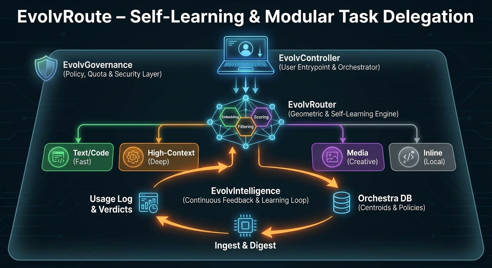

# EvolvRoute

**by Daxesh Patel**

> Routing that gets cheaper the more you use it.

[](LICENSE)
[](https://www.python.org/)
[-green.svg)](https://github.com/MinishLab/model2vec)
[](#project-status)

EvolvRoute is a self-learning AI workload router. It learns from every outcome and routes each task to the cheapest model that can actually do the job — so it gets smarter and cheaper the more you use it. Instead of paying frontier prices for every task — or running them all in parallel and paying N× — it embeds each task, scores your available models on cost, capability, and proven track record, and routes to the single cheapest one that can do it. Every result is graded and fed back, so the router's judgment compounds.

## Process Overview



*One task in, one cheapest-capable lane out — every result graded and fed back so the next route is better.*

| Diagram label | Component | Role |
|---|---|---|
| EvolvController | Claude controller / `delegate.sh` entrypoint | Receives the task, owns final judgment, dispatches to a lane |
| EvolvRouter | Geometric router (`router/route.py`, model2vec embed + score) | Embeds the task, applies hard filters, scores models, selects one lane |
| EvolvGovernance | Policy / quota / spend / sandbox gates | Enforces spend caps, quota windows, break-even floor, escalation, sandbox isolation |
| Text/Code lane | `codex_mini` / `codex_55` (fast workers) | Boilerplate, scoped features, tests |
| High-Context lane | `agy` (deep / large-context worker) | Huge-context reads, web-grounded research |
| Media lane | `grok` (image / video) | Media generation |
| Inline lane | `claude_keep` (local) | Tasks kept by Claude directly — no delegation |
| Orchestra DB | `router/orchestra.db` | Centroids & policies the router scores against |
| Usage Log & Verdicts + Ingest & Digest | EvolvIntelligence (`router/ingest.py` + `digest.py`) | The self-learning loop: re-embed, recompute centroids, write stop-cells |

## Table of Contents

- [Why it's different](#why-its-different)
- [How it works](#how-it-works)
- [Quickstart](#quickstart)
- [Configuration](#configuration)
- [Security & data hygiene](#security--data-hygiene)
- [Adding your own model / CLI](#adding-your-own-model--cli)
- [The self-learning loop](#the-self-learning-loop)
- [Design notes](#design-notes)
- [Project status](#project-status)
- [Contributing](#contributing)
- [License & author](#license--author)

## Why it's different

- **Learns from outcomes, not prompts.** Routing is reshaped by accept/edit/reject verdicts and auto-graded failures (timeout, error, empty output) — the router improves from what actually happened, not from keyword or prompt heuristics.
- **Local semantic routing, no embedding API.** Tasks are embedded on-device with [model2vec](https://github.com/MinishLab/model2vec) and matched against learned centroids entirely offline — no embedding calls leave your machine.
- **Cost-governed by design.** Spend caps, quota windows, a break-even floor, and escalation gates bound every dispatch, so the router can never spend its way into trouble.

## How it works

A task enters, the router embeds it and scores every available lane on cost, capability, and proven track record, then selects the single cheapest lane that can do the job; the lane executes with a one-hop fallback if it fails, Claude grades the result, and the verdict feeds back into the router so the next route is sharper. See [ARCHITECTURE.md](ARCHITECTURE.md) for the deep dive.

- **Task** — a unit of work arrives at the controller and is classified (tier, task type, size, modality).
- **Router embed + score** — `route.py` embeds the task (model2vec) and scores lanes on centroid similarity, proven outcomes, cost, and latency.
- **Select ONE cheapest-capable lane** — exactly one lane is chosen, not an N× parallel ensemble (`claude_keep` is the floor and is never excluded).
- **Execute with one-hop fallback** — the lane runs read-only; on timeout or empty output it falls back a single hop.
- **Claude verdict** — the artifact is integrated and graded (accept / edit / reject).
- **Self-learning loop** — the outcome is ingested and digested, so the next routing decision is better.

## Quickstart

```bash
# 1. Install dependencies (model2vec local embedder)
pip install -r requirements.txt

# 2. Seed the ledger and usage log from the examples
cp ledger.jsonl.example ledger.jsonl && cp usage.log.example usage.log

# 3. Build the routing DB (embeddings, centroids, policies) from seed outcomes
python3 router/ingest.py sync

# 4. Roll up per-lane learning stats and write stop-cells
python3 digest.py

# 5. Route a task automatically (router picks the cheapest-capable lane)
./delegate.sh auto "summarize this RFC in 5 bullets"

# 6. Or dispatch to a specific lane (- = that CLI's default model)
./delegate.sh codex - "write a python function that parses ISO-8601 durations"

# 7. Grade the result so the router learns from it
./delegate.sh verdict <id> accept
```

> **Bring your own worker CLIs.** `codex`, `agy`, and `grok` are reference lanes — point EvolvRoute at your own tools by setting `CODEX_BIN` / `AGY_BIN` / `GROK_BIN`, or add a new lane (see below). `jq` is required; `graphviz` is optional (only needed to re-render the diagrams).

## Configuration

The most-used environment variables (defaults pulled from `delegate.sh` and `ARCHITECTURE.md`):

| Name | Default | Effect |
|---|---|---|
| `CODEX_BIN` | `codex` | Binary used for the Text/Code lane |
| `AGY_BIN` | `agy` | Binary used for the High-Context lane |
| `GROK_BIN` | `grok` | Binary used for the Media lane |
| `SPEND_CAP` | unset | Notional USD ceiling on today's spend (gate is off unless set) |
| `STRICT_SPEND` | `0` | When `1`, refuse over-spend dispatch (exit 3) instead of warning |
| `CODEX_CAP` | `40` | Per-owner soft quota cap for codex within its window |
| `AGY_CAP` | `800` | Per-owner soft quota cap for agy within its window |
| `GROK_CAP` | `150` | Per-owner soft quota cap for grok within its window |
| `MIN_DELEGATE_TOKENS` | `1000` (from policies) | Break-even floor — tasks below this stay inline |
| `NO_AUTOSYNC` | `0` | When `1`, skip the post-verdict `ingest` + `digest` |
| `AGY_MIN_TO` | `180` | Minimum timeout (secs) for direct agy calls, floors cold starts |

## Security & data hygiene

- EvolvRoute stores no API keys. Each worker CLI (`codex` / `agy` / `grok`, or your own) authenticates with its OWN session/credentials; EvolvRoute only shells out to them.
- Keep real credentials and session files (e.g. `~/.grok/`, `~/.local/`, provider config dirs) OUTSIDE the project directory — EvolvRoute never reads or copies them.
- `ledger.jsonl` and `usage.log` are gitignored: real queries you run are recorded locally for the learning loop but are never staged or committed. Only the synthetic `*.example` seeds are tracked.
- The ledger stores a `spec_hash` of each task, never the prompt text.
- Do not put secrets in task prompts — they are passed to the worker CLI and may be retained by that tool's own session store.
- Workers run sandboxed (`codex` / `grok` read-only; `agy` from a throwaway scratch cwd) so delegated tasks cannot mutate your repo.

## Adding your own model / CLI

Nothing in the router is hardwired to the three reference lanes — a lane is just a capability card plus a few small touch-points, and once added, the learning loop picks it up automatically with no engine changes. See [docs/ADDING_A_LANE.md](docs/ADDING_A_LANE.md) for the step-by-step.

## The self-learning loop

Every dispatched call writes a row to the ledger, and each result gets a verdict — automatically when a call fails (timeout, error, or empty output is recorded as a negative verdict with zero human input) or manually via `./delegate.sh verdict <id> accept|edit|reject`. `python3 router/ingest.py sync` then joins calls to verdicts, re-embeds the outcomes, and recomputes each lane's centroid in the Orchestra DB. `python3 digest.py` rolls up per-lane quality and writes stop-cells (consistently-bad `lane × task_type` pairs) to `router/stopcells.json`. The next `auto` call reads the updated centroids, outcomes, and stop-cells — so routing gets better, and cheaper, the more you use it.

## Design notes

- [ARCHITECTURE.md](ARCHITECTURE.md) — the full system spec: components, request flow, the geometric router, governance gates, subcommands, and env vars.
- [FUSION_COMPARISON.md](FUSION_COMPARISON.md) — how EvolvRoute differs from OpenRouter Fusion: selection + memory (route to one cheapest-capable model and learn) vs a parallel ensemble (run many, pay N×, judge).

## Project status

**Alpha.** Single-user, single-host by design — no collaboration layer and no web UI. Interfaces and defaults may change.

## Contributing

Contributions are welcome. See [CONTRIBUTING.md](CONTRIBUTING.md).

## License & author

Licensed under the [Apache License 2.0](LICENSE).

Created and maintained by **Daxesh Patel**.
